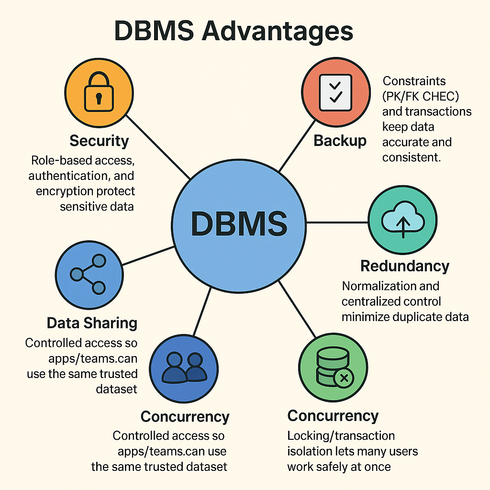

# Database-Course-Documentation

## 1\. Flat File Systems vs. Relational Databases

| Feature              | Flat File System | Relational Database |

|----------------------|------------------|---------------------|

| \*\*Structure\*\*        | Stores all data in one file, usually plain text or CSV. | Stores data in multiple linked tables. |

| \*\*Data Redundancy\*\*  | High – same data may be stored many times. | Low – avoids duplication using keys. |

| \*\*Relationships\*\*    | No built-in relationships. | Uses primary and foreign keys to link tables. |

| \*\*Example Usage\*\*    | Contact lists in CSV files. | Banking systems, online stores. |

| \*\*Drawbacks\*\*        | Hard to update, prone to errors, poor scalability. | Needs setup and management skills. |

## 2) DBMS Advantages – Mind Map

## 3\. Roles in a Database System
| Role | What They Do |
|------|--------------|
| **System Analyst** | Gathers business needs and defines data/system requirements. |
| **Database Designer** | Creates the conceptual/logical schema, tables, keys, and relationships. |
| **Database Developer** | Builds the DB objects (tables, views, procedures) and queries. |
| **Database Administrator (DBA)** | Manages users, security, backups, performance, and recovery. |
| **Application Developer** | Writes application code that reads/writes data via the DB. |
| **BI Developer** | Builds reports, dashboards, ETL/ELT pipelines, and analytics models. |

## 4\. Types of Databases
### Relational vs Non-Relational
- **Relational (RDBMS):** Tables with rows/columns; SQL; strong consistency. *Examples:* MySQL, PostgreSQL, SQL Server.  
- **Non-Relational (NoSQL):** Flexible models (document, key-value, column, graph). *Examples:* **MongoDB**, **Cassandra**.

### Centralized vs Distributed vs Cloud
- **Centralized:** Single location/instance; simpler to manage; single point of failure.  
  *Use case:* Small office ERP, school system.
- **Distributed:** Data split/replicated across sites; better availability/latency.  
  *Use case:* Multi-branch banks, global apps.
- **Cloud:** Managed DB on cloud infra; elastic scaling and HA.  
  *Use case:* Web/mobile apps needing quick scale and low ops.

## 5\. Cloud Storage and Databases

**What is Cloud Storage?**  
Remote storage provided by a cloud vendor (object/block/file). Databases use it for durable data files, logs, and backups.

**Advantages of Cloud Databases (e.g., Azure SQL, Amazon RDS, Google Cloud Spanner):**
- Elastic scale (compute/storage) and high availability out of the box.
- Reduced ops: automated patching, backups, monitoring.
- Global access and integration with cloud services.

**Disadvantages/Challenges:**
- Requires reliable internet; potential latency.
- Ongoing costs; egress fees; capacity planning still matters.
- Vendor lock-in and compliance/security configuration responsibilities.
